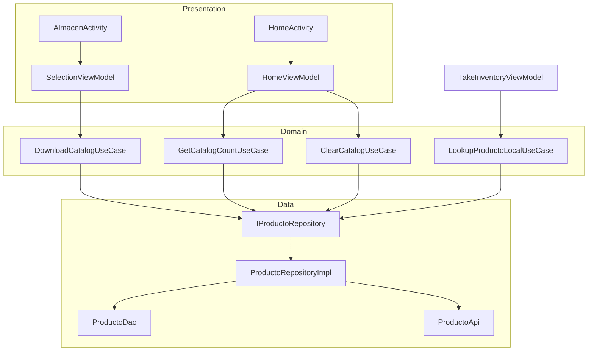
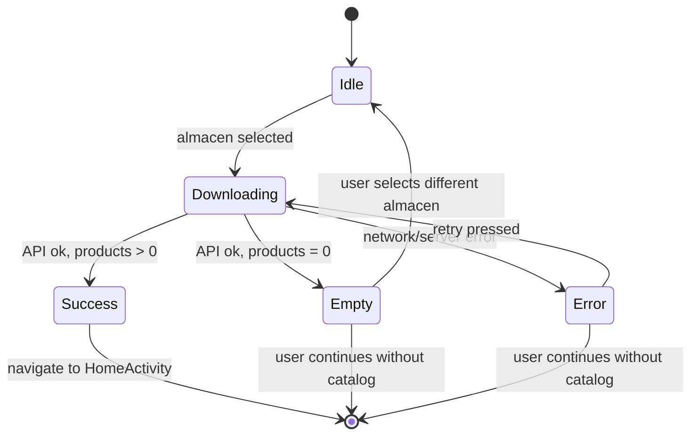

# Design Document: Offline Product Catalog

## Overview

The Offline Product Catalog feature enables warehouse operators to download and cache the complete product catalog for their assigned sucursal/almacen, then perform instant QR code lookups without network connectivity.

The feature integrates into the existing app flow: after selecting an almacen in `AlmacenActivity`, the system downloads all products via the `/api/nisira/producto-stock` API (omitting `idProducto` to get the full catalog), stores them in the existing Room database's `Producto` table, and then allows offline lookups during inventory taking. The home screen displays catalog status and provides a manual clear option.

### Key Design Decisions

1. **Reuse existing `ProductoEntity` / `ProductoDao`** — The table and DAO already exist with all required fields and a `refreshCatalogo()` transactional method. No schema migration needed.
2. **Download triggered in `AlmacenActivity`** — The catalog download happens immediately after almacen selection, before navigating to `HomeActivity`. This guarantees the operator always has a fresh catalog.
3. **No background sync** — The catalog is a point-in-time snapshot. There is no periodic background refresh; the data is replaced each time the operator selects an almacen.
4. **Null `idProducto` for full catalog** — The existing `ProductoStockRequest` already supports a nullable `idProducto` field. Passing `null` tells the API to return all products.

## Architecture



The architecture follows the existing MVVM pattern with:
- **Presentation layer**: Activities observe ViewModel LiveData for UI state.
- **Domain layer**: Use cases encapsulate single business operations.
- **Data layer**: Repository implementation coordinates between API (Retrofit) and local DB (Room).

## Components and Interfaces

### New Use Cases

#### `DownloadCatalogUseCase`
Orchestrates the full catalog download: calls the API, validates the response, and persists to Room.

```java
public class DownloadCatalogUseCase {
    private final IProductoRepository productoRepository;

    public DownloadCatalogUseCase(IProductoRepository productoRepository) {
        this.productoRepository = productoRepository;
    }

    /**
     * Downloads all products for the given sucursal/almacen and stores them locally.
     * @return the number of products stored
     * @throws Exception on network/server errors
     */
    public int execute(String idSucursal, String idAlmacen) throws Exception;
}
```

#### `LookupProductoLocalUseCase`
Performs a local-only product lookup by ID (scanned QR code).

```java
public class LookupProductoLocalUseCase {
    private final IProductoRepository productoRepository;

    public LookupProductoLocalUseCase(IProductoRepository productoRepository) {
        this.productoRepository = productoRepository;
    }

    /**
     * Looks up a product in the local catalog.
     * @param idProducto the scanned QR code content
     * @return Producto domain object
     * @throws IllegalArgumentException if idProducto is null or empty
     * @throws Exception if product not found in local catalog
     */
    public Producto execute(String idProducto) throws Exception;
}
```

#### `ClearCatalogUseCase`
Deletes all locally stored products.

```java
public class ClearCatalogUseCase {
    private final IProductoRepository productoRepository;

    public ClearCatalogUseCase(IProductoRepository productoRepository) {
        this.productoRepository = productoRepository;
    }

    /**
     * Clears all products from local storage.
     */
    public void execute() throws Exception;
}
```

#### `GetCatalogCountUseCase`
Returns the count of locally stored products.

```java
public class GetCatalogCountUseCase {
    private final IProductoRepository productoRepository;

    public GetCatalogCountUseCase(IProductoRepository productoRepository) {
        this.productoRepository = productoRepository;
    }

    /**
     * @return number of products in local catalog
     */
    public int execute();
}
```

### Repository Interface Changes

Extend `IProductoRepository` with new methods:

```java
public interface IProductoRepository {
    // Existing
    Producto fetchProductoStock(String idSucursal, String idAlmacen, String idProducto) throws Exception;

    // New: Download full catalog and store locally
    int downloadAndStoreCatalog(String idSucursal, String idAlmacen) throws Exception;

    // New: Local-only lookup
    Producto getProductoLocal(String idProducto);

    // New: Clear all local products
    void clearLocalCatalog();

    // New: Count of locally stored products
    int getLocalProductCount();
}
```

### DAO Changes

Add a count query to `ProductoDao`:

```java
@Dao
public interface ProductoDao {
    // Existing methods remain unchanged...

    // New: count query for catalog status display
    @Query("SELECT COUNT(*) FROM Producto")
    int getProductCount();
}
```

### ViewModel Changes

#### `SelectionViewModel` — Add catalog download state

New LiveData fields:
- `MutableLiveData<Boolean> isDownloading` — progress indicator
- `MutableLiveData<DownloadResult> downloadResult` — success/error/empty states

New method:
```java
public void downloadCatalogAndNavigate(String idSucursal, String idAlmacen);
```

#### `HomeViewModel` — Add catalog status and clear

New LiveData fields:
- `MutableLiveData<Integer> catalogCount` — product count for display
- `MutableLiveData<Boolean> clearSuccess` — result of clear operation

New methods:
```java
public void loadCatalogCount();
public void clearCatalog();
```

### UI Changes

#### `AlmacenActivity`
- After almacen selection, trigger `downloadCatalogAndNavigate()` instead of navigating directly.
- Show a `ProgressBar` / overlay during download.
- Show error dialog with retry button on failure.
- Provide "Continuar sin catálogo" button to skip to HomeActivity.

#### `HomeActivity`
- Display catalog count in a `TextView` (e.g., "150 productos disponibles offline" or "Sin catálogo offline").
- Add a "Limpiar Catálogo" button with confirmation dialog.

## Data Models

### Existing `ProductoEntity` (unchanged)

The existing entity already has all fields needed:

| Field | Type | Notes |
|-------|------|-------|
| idProducto | String (PK) | Product identifier, matches QR code |
| idEmpresa | String | Company ID |
| descripcion | String | Product description |
| idMedida | String | Unit of measure |
| idGrupo | String | Group ID |
| grupoDsc | String | Group description |
| idSubGrupo | String | Subgroup ID |
| subgrupoDsc | String | Subgroup description |
| stock | Double | Available stock quantity |
| disponible | Double | Available quantity |
| nombreComercial | String | Commercial name |
| idUbicacion | String | Location ID |
| tipoproducto | String | Product type |
| propiedad | String | Property |
| idCultivo | String | Crop ID |
| cultivo | String | Crop name |
| idVariedad | String | Variety ID |
| variedad | String | Variety name |
| estado | Integer | Status (1=active) |
| ultFecha | String | Last update date |

### `DownloadResult` (new sealed class-like enum)

```java
public class DownloadResult {
    public enum Status { SUCCESS, ERROR, EMPTY }

    private final Status status;
    private final int productCount;
    private final String errorMessage;

    // Static factory methods
    public static DownloadResult success(int count);
    public static DownloadResult error(String message);
    public static DownloadResult empty();
}
```

### State Flow During Download



## Correctness Properties

*A property is a characteristic or behavior that should hold true across all valid executions of a system — essentially, a formal statement about what the system should do. Properties serve as the bridge between human-readable specifications and machine-verifiable correctness guarantees.*

### Property 1: Catalog request omits idProducto

*For any* valid sucursal ID and almacen ID, the `ProductoStockRequest` constructed for a full catalog download SHALL have a null `idProducto` field, ensuring the API returns all products rather than a single one.

**Validates: Requirements 1.1**

### Property 2: Catalog refresh replaces all data

*For any* two lists of products A and B, if the Local_Product_Store initially contains A and then `refreshCatalogo(B)` is called, the store SHALL contain exactly the products in B (same IDs, same count) and none from A that are not also in B.

**Validates: Requirements 2.1, 2.3, 2.4**

### Property 3: Store-then-lookup round trip

*For any* valid `ProductoEntity` stored via `refreshCatalogo`, querying by that product's `idProducto` SHALL return a `Producto` domain object whose fields (descripcion, stock, disponible, idMedida, nombreComercial, idGrupo, grupoDsc, idSubGrupo, subgrupoDsc, idUbicacion, tipoproducto, propiedad, idCultivo, cultivo, idVariedad, variedad, estado) are equivalent to the original entity's values.

**Validates: Requirements 3.1, 3.2**

### Property 4: Non-existent ID lookup returns not-found

*For any* product ID string that does not match any `idProducto` in the Local_Product_Store, the `LookupProductoLocalUseCase` SHALL throw an exception indicating the product was not found in the offline catalog.

**Validates: Requirements 3.3**

### Property 5: Cancel clear is a no-op

*For any* state of the Local_Product_Store containing N products, if the clear operation is initiated but then cancelled (i.e., `clearLocalCatalog()` is never called), the store SHALL still contain exactly N products with identical data.

**Validates: Requirements 4.3**

### Property 6: Confirmed clear empties the store

*For any* state of the Local_Product_Store containing N ≥ 0 products, after calling `clearLocalCatalog()`, the store SHALL contain exactly zero products.

**Validates: Requirements 4.4**

### Property 7: Product count reflects stored catalog size

*For any* list of N products stored via `refreshCatalogo`, `getLocalProductCount()` SHALL return exactly N.

**Validates: Requirements 5.1, 5.2, 5.3**

## Error Handling

### Network Errors (Download)

| Scenario | Behavior |
|----------|----------|
| No internet connectivity | Show "Sin conexión a internet. Verifica tu conexión e intenta de nuevo." with retry button |
| Server timeout (>30s) | Show "El servidor no respondió a tiempo. Intenta de nuevo." with retry button |
| API returns `success=false` | Show the server's error `message` field with retry button |
| HTTP 401 Unauthorized | Handled by existing `TokenAuthenticator` (auto-refresh) |
| HTTP 5xx | Show "Error del servidor. Intenta más tarde." with retry button |

In all error cases, the user also sees a "Continuar sin catálogo" option to navigate to HomeActivity without a local catalog.

### Local Database Errors

| Scenario | Behavior |
|----------|----------|
| Room transaction fails during refresh | Exception propagates; old data remains intact (transaction rollback) |
| Room fails during clear | Show "No se pudo limpiar el catálogo. Intenta de nuevo." toast |
| Query returns null unexpectedly | Return "Producto no encontrado" to caller |

### Input Validation

| Input | Validation |
|-------|-----------|
| QR code null or empty | `IllegalArgumentException("El código escaneado no contiene un identificador válido")` |
| QR code > 50 chars | Truncate to 50 chars before lookup (defensive) |
| idSucursal null/empty | Throw before download attempt |
| idAlmacen null/empty | Throw before download attempt |

## Testing Strategy

### Property-Based Tests (jqwik)

The project will add [jqwik](https://jqwik.net/) as a test dependency for property-based testing. jqwik is the standard PBT library for JVM/Java projects.

**Dependency to add:**
```kotlin
testImplementation("net.jqwik:jqwik:1.8.4")
```

**Configuration:**
- Minimum 100 iterations per property test (`@Property(tries = 100)`)
- Each test references its design property via tag comment
- Tag format: `Feature: offline-product-catalog, Property {number}: {property_text}`

**Properties to implement:**
1. Catalog request construction (Property 1) — pure function, no DB needed
2. Catalog refresh replaces all data (Property 2) — uses in-memory Room DB
3. Store-then-lookup round trip (Property 3) — uses in-memory Room DB + mapper
4. Non-existent ID returns not-found (Property 4) — uses in-memory Room DB
5. Clear empties store (Property 6) — uses in-memory Room DB
6. Count reflects stored size (Property 7) — uses in-memory Room DB

Property 5 (cancel no-op) is trivial at the code level since cancellation never calls the DAO, so it can be verified with a simple example-based test.

### Unit Tests (JUnit + Mockito)

- `DownloadCatalogUseCaseTest` — Mock repository; verify correct delegation and error propagation
- `LookupProductoLocalUseCaseTest` — Verify null/empty input validation, not-found exception
- `ClearCatalogUseCaseTest` — Verify delegation to repository
- `SelectionViewModelTest` — Verify LiveData state transitions (idle → downloading → success/error/empty)
- `HomeViewModelTest` — Verify catalog count loading and clear logic

### Instrumented Tests (AndroidTest)

- `AlmacenActivity` catalog download flow with MockWebServer
- `HomeActivity` displays correct catalog status and clears correctly
- End-to-end: select almacen → download → scan QR → get product data offline
