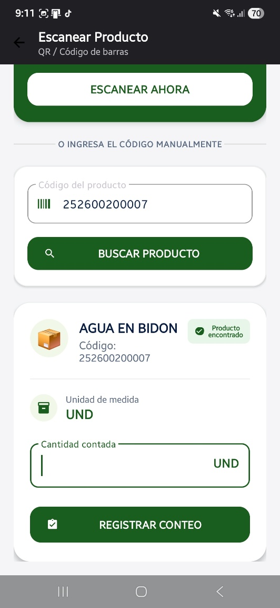
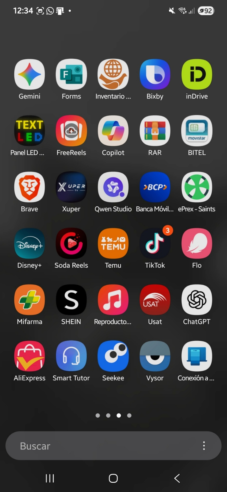
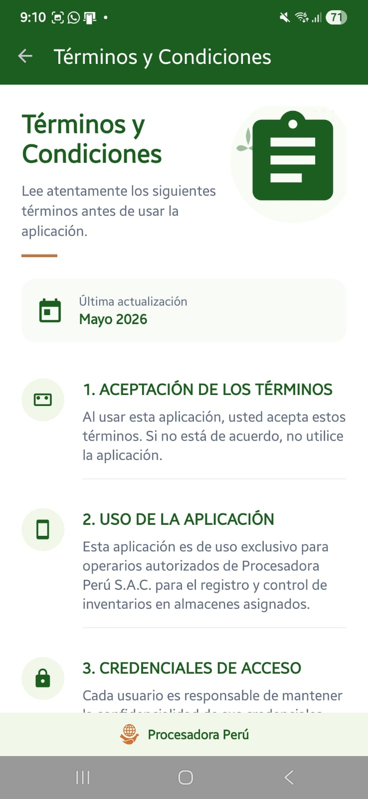
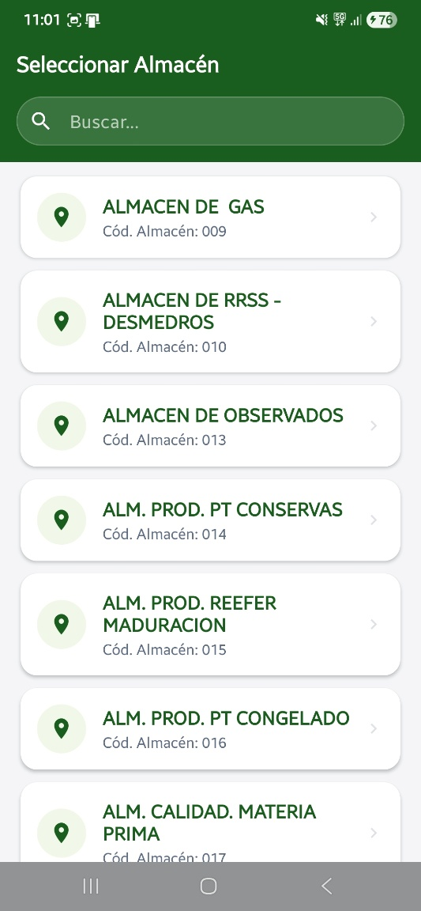
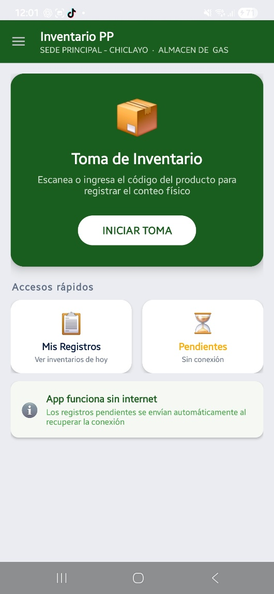
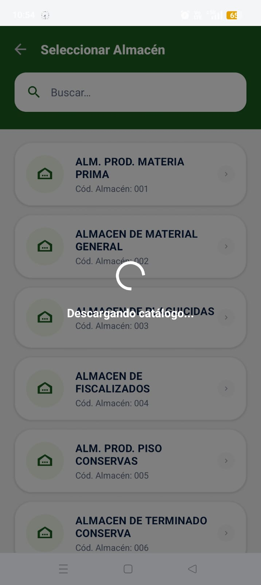

# Aplicación Móvil de Inventario — Procesadora Perú S.A.C.

App Android **offline-first** para la toma de inventario en campo, desarrollada para los operarios de Procesadora Perú S.A.C. Reemplazó el registro manual en hojas Excel, reduciendo el tiempo operativo en más del 40%.

## Capturas de pantalla

<p align="center">
  
  
  
  
</p>
<p align="center">
  
  
</p>

## Funcionalidades

- **Autenticación JWT** con refresh automático y sesión persistente
- **Selección de sucursal y almacén** desde la API oficial de Procesadora Perú
- **Toma de inventario** — escaneo de código de barras + ingreso manual de cantidad
- **Modo offline-first** — los registros se guardan localmente (Room/SQLite) cuando no hay conexión
- **Sincronización automática** — WorkManager detecta reconexión y sube los registros pendientes
- **Registros pendientes** — vista de ítems por sincronizar con botón de sync manual
- **Historial de inventarios** — registros enviados exitosamente al servidor
- **Perfil de usuario** — información del operario y cambio de ubicación
- **Consulta de productos** — búsqueda por nombre o escaneo de código de barras

## Tecnologías

- **Lenguaje:** Java (Android SDK 35)
- **Arquitectura:** MVVM (ViewModel + LiveData)
- **Base de datos local:** Room (SQLite)
- **Red:** Retrofit 2 + OkHttp (con interceptor de autenticación)
- **Sincronización offline:** WorkManager
- **Seguridad:** JWT con TokenAuthenticator y refresh automático
- **Permisos:** GPS, cámara, red

## Arquitectura offline-first

```
Operario registra producto
        │
        ▼
Room/SQLite (local)  ──→  Pantalla actualizada al instante
        │
        ▼
¿Hay conexión?
   Sí ──→ Retrofit sube a API ──→ Registro sincronizado
   No ──→ WorkManager encola ──→ Reintenta al reconectarse
```

## Impacto operacional

Desplegada para **más de 100 operarios en campo** en **más de 20 almacenes**, digitalizando por completo un proceso que antes se realizaba en hojas de papel y Excel.

## Parte de un ecosistema mayor

Esta app es uno de tres sistemas integrados desarrollados para Procesadora Perú:

- **App Android** (este repositorio) → toma de inventario en campo
- **Intranet Web GIS** (monitoreo en tiempo real) → [intranet-procesadora-peru](https://github.com/AlonsoUSAT/intranet-procesadora-peru)
- **Sitio web corporativo** (React + Vite) → [web-procesadora-peru](https://github.com/AlonsoUSAT/web-procesadora-peru)

## Equipo de desarrollo

Proyecto desarrollado en **USAT** (Universidad Católica Santo Toribio de Mogrovejo) para Procesadora Perú S.A.C., equipo de **25 desarrolladores**.
